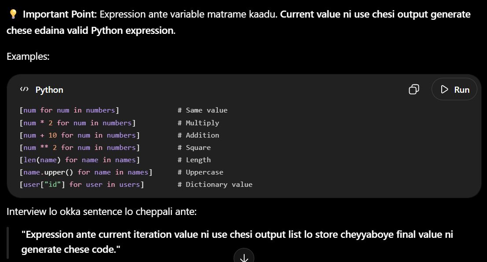

1. Normal List Comprehension
new_list = [expression for variable in iterable]

Example

numbers = [10, 20, 30]

new_list = [num for num in numbers]

Syntax Breakdown

expression → Output lo emi store cheyyali.
for → Iteration start chestundi.
variable → Current item ni hold chestundi.
iterable → Data source (List, Tuple, Set, Dictionary...)

2. List Comprehension with if (Filtering)
new_list = [expression for variable in iterable if condition]

Example

numbers = [10, 15, 20, 25]

new_list = [num for num in numbers if num % 2 == 0]

Syntax Breakdown

expression → Output lo emi store cheyyali.
for → Iteration start chestundi.
variable → Current item.
iterable → Data source.
if condition → True ayithe matrame output list lo add chestundi.

3. List Comprehension with if...else
new_list = [value_if_true if condition else value_if_false for variable in iterable]

Example

numbers = [10, 15, 20]

new_list = ["Even" if num % 2 == 0 else "Odd" for num in numbers]

Syntax Breakdown

value_if_true → Condition True ayithe output.
if condition → Check chestundi.
else value_if_false → Condition False ayithe output.
for → Iteration start chestundi.
variable → Current item.
iterable → Data source.
Easy Memory Trick

Normal

[Expression  for  Variable  in  Iterable]

With if

[Expression  for  Variable  in  Iterable  if  Condition]

With if...else

[Value_If_True  if  Condition  else  Value_If_False  for  Variable  in  Iterable]

💡 Remember one simple rule:

if after iterable → Filtering (items ni skip cheyyachu)
if...else before for → Every item ki output create chestundi (e item ni skip cheyyadu)

1. Normal List Comprehension

Normal List Comprehension lo Expression mariyu For Loop untayi. First, for loop iterable ni iterate chestundi mariyu prati iteration lo oka value ni loop variable ki assign chestundi. Tarvata expression aa current value ni use chesi result create chestundi. Aa result automatic ga new list lo add avuthundi. Ee process iterable lo unna anni values complete ayye varaku continue avuthundi.

2. List Comprehension with if Condition

Ee type List Comprehension lo Expression, For Loop, mariyu if Condition untayi. First, for loop iterable ni iterate chesi current value ni loop variable ki assign chestundi. Tarvata if condition aa current value ni check chestundi. Condition True ayithe matrame aa value expression ki velthundi. Appudu expression execute ayi result ni new list lo add chestundi. Condition False ayithe expression execute avvadu, aa value skip aipothundi. Kabatti condition satisfy ayina values matrame final list lo untayi.

3. List Comprehension with if...else

Ee type List Comprehension lo Expression mariyu For Loop untayi. Kani ikkada Expression ante if...else expression. First, for loop iterable ni iterate chesi current value ni loop variable ki assign chestundi. Tarvata expression lo unna if condition evaluate avuthundi. Condition True ayithe if mundu unna value return avuthundi. Condition False ayithe else tarvata unna value return avuthundi. Ee result automatic ga new list lo add avuthundi. Ikkada important point enti ante, prati iteration ki compulsory oka output generate avuthundi, kabatti e value kuda skip avvadu.

Main Difference (Interview Explanation)

for tarvata if vaste, adi Filtering kosam use chestaru. Ante condition satisfy ayina values matrame final list lo untayi, migatha values skip aipothayi.

for mundu if...else vaste, adi Conditional Output kosam use chestaru. Ante prati iteration ki condition check chesi oka output create chestundi. Kabatti ikkada e iteration kuda skip avvadu, prati input ki oka output compulsory generate avuthundi.

💡 Presentation Tip: "Loop value ni expression ki pass chestundi" ani cheppadam kanna, "Loop current value ni loop variable ki assign chestundi. Aa loop variable ni expression use chestundi." ani cheppadam technically correct mariyu interview lo professional explanation ga untundi.

[num for num in numbers]              # Same value
[num * 2 for num in numbers]          # Multiply
[num + 10 for num in numbers]         # Addition
[num ** 2 for num in numbers]         # Square
[len(name) for name in names]         # Length
[name.upper() for name in names]      # Uppercase
[user["id"] for user in users]        # Dictionary value